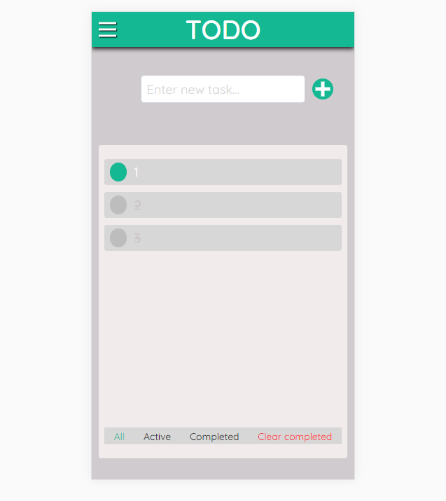

# Todo App

`html` `css` `javascript` `ReactJS`

by [Thaison Dang](https://github.com/thaisonbk57)

Try the [DEMO](https://todo-app-bk57.firebaseapp.com/)

# Features

- create/update/delete Todo tasks.
- double click on a Todo-Item to edit it.
- ultilize localStorage to save data of the app.
- excelent responsiveness on all devices.
